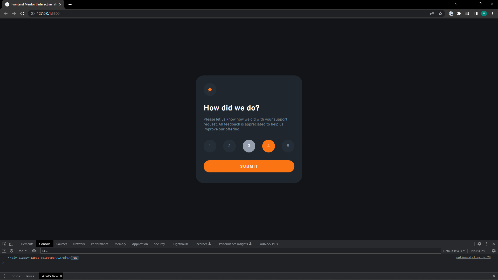

# Frontend Mentor - Interactive rating component solution

This is a solution to the [Interactive rating component challenge on Frontend Mentor](https://www.frontendmentor.io/challenges/interactive-rating-component-koxpeBUmI). Frontend Mentor challenges help you improve your coding skills by building realistic projects. 

## Table of contents

- [Overview](#overview)
  - [The challenge](#the-challenge)
  - [Screenshot](#screenshot)
  - [Links](#links)
- [My process](#my-process)
  - [Built with](#built-with)
  - [What I learned](#what-i-learned)
- [Author](#author)

## Overview

### The challenge

Users should be able to:

- View the optimal layout for the app depending on their device's screen size
- See hover states for all interactive elements on the page
- Select and submit a number rating
- See the "Thank you" card state after submitting a rating

### Screenshot

Desktop hover:

Desktop hover on submit:

Desktop after submitting:

Mobile:

Mobile after submitting:

### Links

- Solution URL: [FrontendMentor.io](https://www.frontendmentor.io/solutions/interactive-rating-component-using-html-form-and-javascript-Qm-7QFLxCF)
- Live Site URL: [MarkVanweersch GitHub Pages](https://markvanweersch.github.io/)

## My process

### Built with

- HTML Forms
- CSS custom properties
- Flexbox
- JavaScript

### What I learned

Using event.target and event.currentTarget will give different results. I ran into an issue where clicking exactly on the number of a rating, the lighter background would apply to the number itself instead of the whole circle. This was due to event.target, which I changed to event.currentTarget.

The button is placed outside of the form. Having it placed inside the form would renew the page when submitting, since there isn't somewhere to submit to. Because of the the next card wouldn't be shown. Ideally the button would be inside the form, submitting the result and then changing to the "Thank you" card. Now it only changes to the next card.

## Author

- Website - [Mark Vanweersch](https://markvanweersch.github.io/)
- Frontend Mentor - [@MarkVanweersch](https://www.frontendmentor.io/profile/MarkVanweersch)